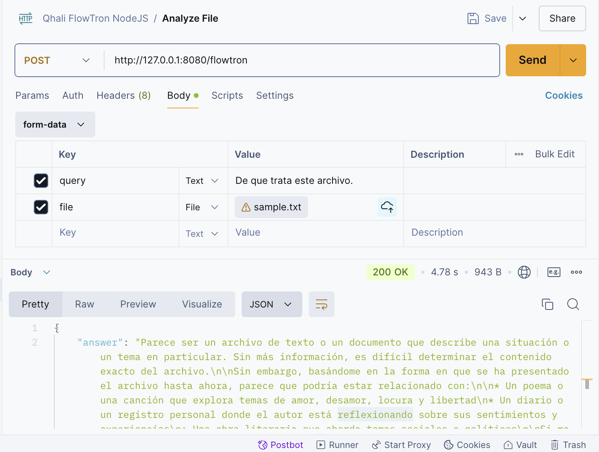
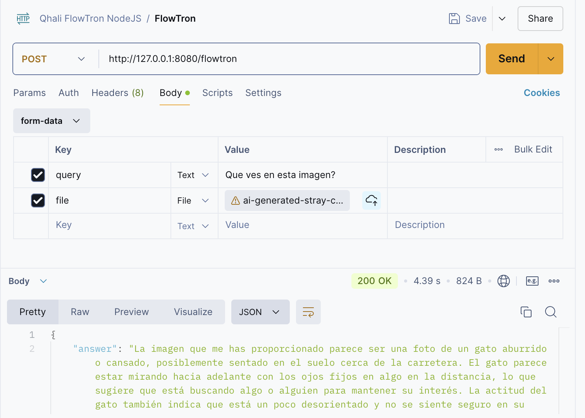

# Qhali FlowTron API

Mirror project of the Flowise Chatflow: Qhali FlowTron built with JavaScript code instead.

## 🤓 About
Qhali FlowTron is intended to be a medical assistant chatbot that contains different tools useful for healthcare practicioners. 
This whole process is built using [Flowise](https://flowiseai.com/), a Low-Code drag&drop tool useful to build LLMs easily and fast.

Now, the intention of this project is to replicate its functionality with actual code. The expected result will be an API that can be used in different chatbot programs as the backend.

## 🔧 Coding Tools

### Libraries
- `ExpressJS` for bulding the API route
- `LangChain` for using LLMs, embeddings
- `Ollama` for implementing the LLM chat
- `HuggingFace Inference` for implementing the Image-to-Text model from Hugging Face

### LLM and ML related tools
- `LLAMA-3.2` as the LLM
- `nlpconnect/vit-gpt2-image-captioning` as the vision model to analyze images (looking for a better one)
- `nomic-embed-text` as the embedding model

### Other Programs
- `Postman` to test the API
- `Ollama Desktop` to pull and use the LLMs locally
- `Pinecone` as the Vectorized DataBase to store the medical related docs and file analysis embeddings

## 🗂️ Source Folder Structure

    src
    |_ controllers
        |_ toolAgent.js
        |_ toolDecider.js
    |_ examples
        |_ testFileHandler.js
        |_ testImgClassifier.js
        |_ testMedScientist.js
        |_ testOllama.js
        |_ testToolAgent.js
        |_ testToolDecider.js
    |_ prev
        |_ pdfs
            |_ medicina_interna.pdf
        |_ ingest_pinecone.py
    |_ tools
        |_ fileHandler.js
        |_ imgClassifier.js
        |_ medScientist.js
        |_ webAstronaut.js
    |_app.js

## ⚙️ Configuration

1. Create a .env file with the following values

        PINECONE_API_KEY=
        PINECONE_INDEX_NAME=
        PINECONE_ENVIRONMENT=

        HF_TOKEN=

2. Change the `dotenv config path` in:

    - `src/app.js`
    - `src/tools/medScientist.js`
    - `src/tools/imgClassifier.js`

3. Install all the packages

        npm i   

## 🧑‍💻 Implementation

Run:

    npm start

Test it in Postman:

1. Create a new POST request with URL: `http://127.0.0.1:8080/flowtron`

2. Go to `Body > form-data` and add the values: `query` and `file`

3. `query` must be a Text value and `file` must be a File value.

## 🐋 Dockerfile

>[!WARNING]
> This only works on Linux machines

- Run the following commands:

        docker build -t qhali-flowtron:latest . 
        docker run --network host -p 8080:8080 qhali-flowtron:latest

`--network host` Only works on Linux. If you're using Windows or macOS, this won't work.

## 🧠 Examples

